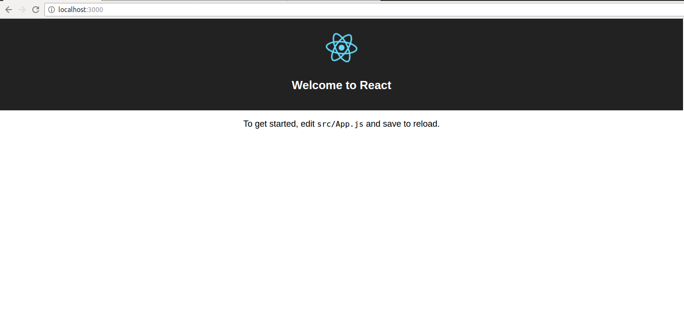
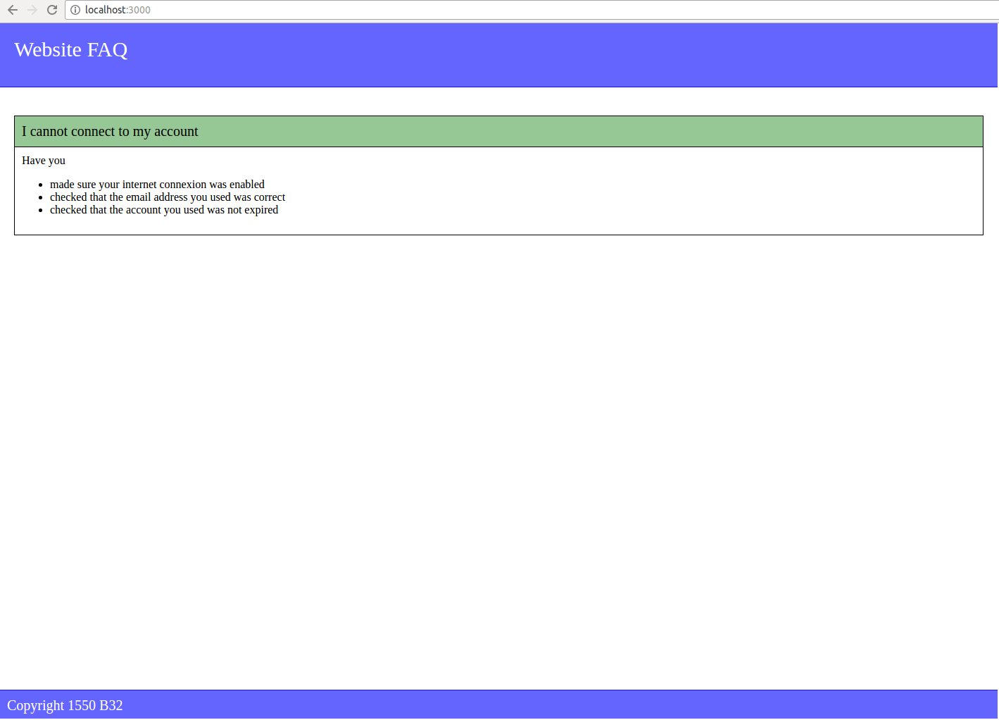
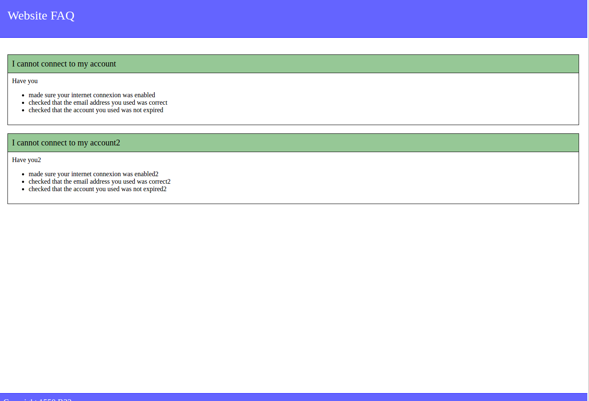
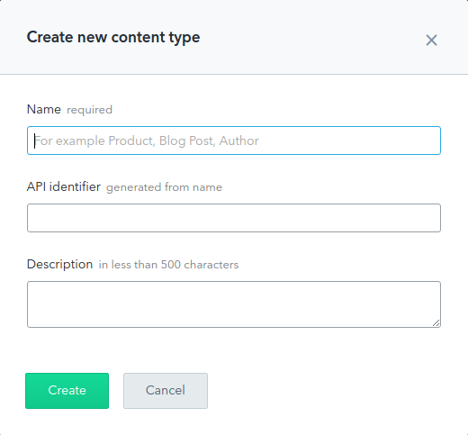
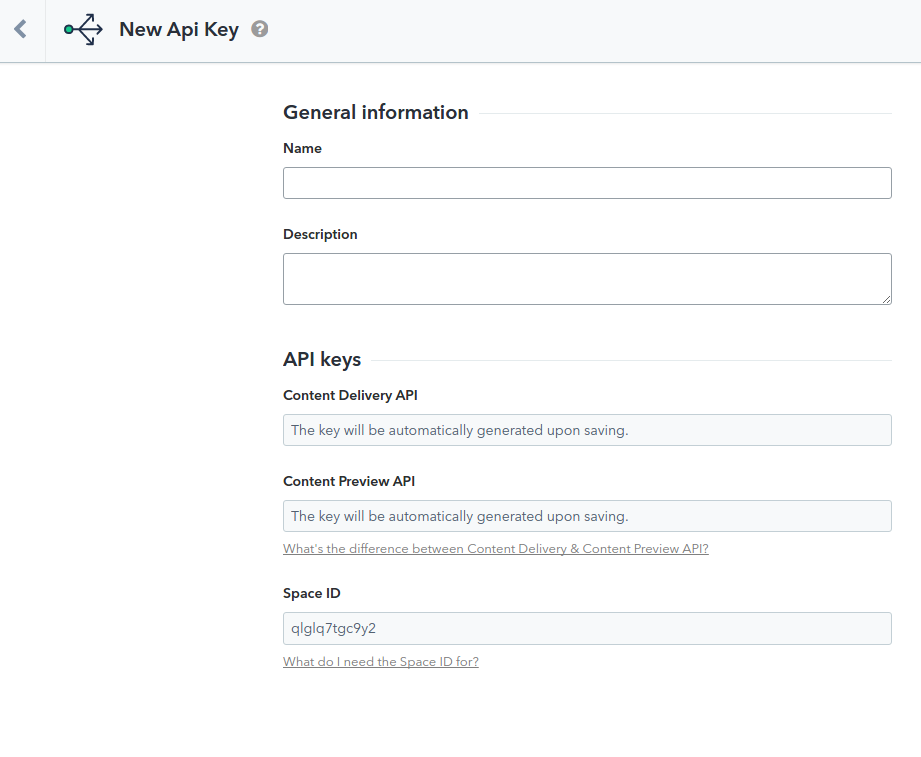

# Get a dynamic FAQ in a pure front app with Contentful

Contentful is a content management system (CMS) that allows you to dynamically update
your pure front application pages' content without editing/re-compiling your code.
It is flexible, free and secure.  
For those of you who already use a backend in their applications, using Contentful helps
you with data management since you don't need to create a specific databse for your
dynamic pages.  
You can get more information about Contentful on the official webpage:
https://www.contentful.com/

Now less talking and more doing! Let's see how we can implement this very simple tool.


## My FAQ: Introduction

In this blog, we will see how to use contentful in the context of a FAQ.
Contentful supports many languages such as Python, PHP but also JavaScript.
We are going to use React (ES6) architecture to code our pure front app and implement
Contentful within it.  
For those of you who don't know React yet, we will describe it very quickly in the next
paragraphs but you can have more information about it on the official facebook page or here:
https://www.codementor.io/reactjs/tutorial/react-js-flux-architecture-tutorial


## Setting up React

First of all, to work with react, you need to have NodeJS and npm installed.  
You can download NodeJS here : https://nodejs.org/en/
and install npm with this command:  
` curl http://npmjs.org/install.sh | sh `.

Then, run ` npm install -g create-react-app `.
This will install a node module in your system. This module allows us to create instantiate
React apps very quickly.

Once this is installed, let's go to MyFAQ directory (the name of our project) and
let's create or first app! ` create-react-app my-faq `

You will end up with an architecture like this:
- **my-faq**
  - **node_modules**
  - **public**
    - **favicon.ico** *icon of the application*
    - **index.html** *html file in which the react app will be inserted*
  - **src**
    - **App.css** *style sheet*
    - **App.js** *file containing the react component*
    - **App.test.js** *file for testing*
    - **index.css** *style sheet*
    - **index.js** *js file linking the index.html to the react app*
    - **logo.svg** *image file*
  - **package.json** *contains informations for npm*

This is the default architecture. If you run ` npm start ` and you input `http://localhost:3000`
you should see a beautiful default page.



Now let's update the code to make it look like a FAQ!


## Our FAQ React app

### Setting up basic components

First of all, let's update the architecture. We would rather want something like this:
- **my-faq**
  - **node_modules**
  - **public**
    - **favicon.ico** *icon of the application*
    - **index.html** *html file in which the react app will be inserted*
  - **src**
    - **components**    
      - **App.js** *file containing the react component*
    - **services**
    - **style**
      - **App.css** *style sheet*
      - **index.css** *style sheet*
    - **index.js** *js file linking the index.html to the react app*
  - **package.json** *contains informations for npm*

In the *components* folder, we will put every React block.  
In the *services* folder, we will put any function or logic which can be used by any
component.

Our app will be as simple as possible and organized that way:
- Header
- Content
  - Question/Answer 1
  - Question/Answer 2
  - Question/Answer 3
  - ...
- Footer

We thus need a component for all of them. Let's start with the Header:
```javascript
  import React, { Component } from 'react';

  class Header extends Component {
    render() {
      return (
        <div className="header">
          Website FAQ
        </div>
      );
    }
  }

  export default Header;
```
and the Footer
```javascript
  import React, { Component } from 'react';

  class Footer extends Component {
    render() {
      return (
        <div className="footer">
          Copyright 1550 B32
        </div>
      );
    }
  }

  export default Footer;
```

Nothing very complicated here. The style sheets will be integrated in the index.js file.
You can stylize your components the way you want.

Now, let's implement a Question/Answer block.
```javascript
  import React, { Component } from 'react';

  class Block extends Component {
    render() {
      return (
        <div className="content-block">
          <div className="content-block-title"> I cannot connect to my account</div>
          <div className="content-block-detail">
            Have you
            <ul>
              <li>made sure your internet connexion was enabled</li>
              <li>checked that the email address you used was correct</li>
              <li>checked that the account you used was not expired</li>
            </ul>
          </div>
        </div>
      );
    }
  }

  export default Block;
```

and import it in the ContentPage component:
```javascript
  import React, { Component } from 'react';
  import Block from './Block';

  class ContentPage extends Component {
    render() {
      return (
        <div className="content">
          <Block />
        </div>
      );
    }
  }

  export default ContentPage;

```

Finally, we need to gather the components altogether in the App component.
```javascript
  import React, { Component } from 'react';
  import Header from './Header';
  import ContentPage from './ContentPage';
  import Footer from './Footer';

  class App extends Component {
    render() {
      return (
        <div className="app">
          <Header />
          <ContentPage />
          <Footer />
        </div>
      );
    }
  }

  export default App;
```

Let's not forget the include the style sheets in the index.js file.
For those of you interested, I separated the style in 2 files:

main.css
```css
  html, body, #root {
    height: 100%;
  }

  body {
    margin: 0;
    padding: 0;
  }

  .app {
    height: calc(100% - 215px);
  }

  .header {
    background-color: rgb(100,100,255);
    border-bottom: 1px solid rgb(20,20,255);
    height: 50px;
    width: calc(100% - 40px);
    color: white;
    font-size: 30px;
    padding: 20px;
    margin-bottom: 20px;
  }

  .footer {
    background-color: rgb(100,100,255);
    border-top: 1px solid rgb(20,20,255);
    height: 20px;
    width: calc(100% - 20px);
    color: white;
    font-size: 20px;
    padding: 10px;
  }
```

content.css
```css
  .content {
    padding: 20px;
    margin-bottom: 20px;
    min-height: 100%;
  }

  .content-block {
    border: 1px solid black;
    margin-bottom: 20px;
  }

  .content-block-title {
    background-color: rgb(150, 200, 150);
    padding: 10px;
    font-size: 20px;
    border-bottom: 1px solid black;
  }

  .content-block-detail {
    padding: 10px;
  }
```

Here is the result you should have on your browser:



It seems pretty cool but we only have one block here


### Setting up several Question/Answer blocks

It is now time to have several Questions/Answers block and to give some
content to our app.  
We will start by editing the Block component to display dynamic content instead
of raw information. We will assume that this content is passed through props.

```javascript
import React, { Component } from 'react';

class Block extends Component {
  render() {
    return (
      <div className="content-block">
        <div className="content-block-title">{this.props.title}</div>
        <div className="content-block-detail">
          {this.props.content}
        </div>
      </div>
    );
  }
}

export default Block;
```
If you insert `{this.props.content}` between the `div` brackets, no HTML code will
be interprated as so.
Since we are supposed to display a list of answer (and thus *li* tags),
you have two choices:
  - either you split `props.content` into more accurate information such as
  `props.content.question` and `props.content.answers` which do not contain HTML and
  you adapt the code of the Block component
  - either you allow HTML tags inside the div. Then the syntax is:
  `<div className="content-block-detail" dangerouslySetInnerHTML={{ __html: this.props.content }} />`

Even if it is not the best option, we will go for the dangerouslySetInnerHTML choice,
since our application is very basic.

We should now pass the right props to the Block component.
Instead of calling one Block at a time, we can call as many Blocks as needed for
each question/answer we have.

```javascript
import React, { Component } from 'react';
import Block from './Block';

class ContentPage extends Component {
  render() {
    return (
      <div className="content">
      {
        this.props.blocks.map((block, i) => (
          <Block title={block.title} content={block.content} key={i} />
        ))
      }
      </div>
    );
  }
}

export default ContentPage;
```
In this case, the information is stored in props.blocks shaped like a table of
```
{
  'title': '...',
  'content': '...'
}
```
This information will be defined in the main component, App.js
```javascript
import React, { Component } from 'react';
import Header from './Header';
import ContentPage from './ContentPage';
import Footer from './Footer';

class App extends Component {
  constructor(props) {
    super(props);
    this.state = { blocks: [
      {
          'title':  'I cannot connect to my account',
          'content': `Have you
            <ul>
              <li>made sure your internet connexion was enabled</li>
              <li>checked that the email address you used was correct</li>
              <li>checked that the account you used was not expired</li>
            </ul>`,
      }
    ] };
  }

  render() {
    return (
      <div className="app">
        <Header />
        <ContentPage blocks={this.state.blocks} />
        <Footer />
      </div>
    );
  }
}

export default App;
```

When you refresh the page in your browser, you should not see any difference.
However, it is now very easy to insert a new block by simply adding a new
element in the blocks table.




## Using Contentful

Our FAQ is pretty cool but if we decide to publish it and we realise we want to
update the content, we will need to modify the code and publish it again. Also,
only a *super-qualified-high-level-developer* would be able to do it.  
Another solution would be creating our own backend, setting up a dedicated database,
exposing an API, dealing with all the security stuff, and creating a backoffice for
non-developer workers to update content. Aouch this sounds heavy for a little FAQ.

Do not worry, Contentful is here to help us!


### Setting up Contentful

We are going to need a Contentful account.  
Go to https://www.contentful.com/ and click on the `Try for free` button.
Fill in all the information and then log in. There you go, nothing more complicated.

On the upper left part of the website, click on `My Spaces`, and then `Add a new space`.
Choose `my-faq` as a space name for example, and whatever language you want. Select
`create an empty space` and then click on `Create Space`.


Once you have your space, you need now to create a **Content Type**.
Click on `Content model` and then `Add content type`. Choose a name, `FAQBlock` for
example, leave the `API identifier` empty and enters the description you wish.  
Boom! You have your new content type! Now we need to give it fields!



Select your newly created content type and click on `Add field`. We are going to add
two fields: the **title** and the **content**. For each of them, select `Text` input,
then select `Short text` for **title** and `Long text` for **content**
(If you decided not to inject HTML, you can split your content by checking `Line` and
adapt your code in React to handle it).  
Now you are ready to give some content to your app.

Go in the `Content` tab and create as many FAQ blocks as you want by clicking on
`Add FAQBlock`. Your information is now stored. We need to configure the React app.


### Injecting Contentful inside React

First of all, we need to install Contenful, simply run: `npm install contentful`
in **my-faq** folder.  
Now we are going to create a service exporting the contentful client.

In the service folder, add `contentfulClient.js` and fill it with:
```javascript
var contentful = require('contentful');

const contentfulClient = contentful.createClient({
  space: <My_Space_Id>,
  accessToken: <My_Content_Delivery_Key>
})

export default contentfulClient;
```

In order to use contentful, we are going to need 2 keys.
  - The first one is the key that represents our **my-faq** space. You can easily
  get it when you click on your space because it appears in the url between
  `https://app.contentful.com/spaces/` and `entries`.
  - To get the second one, click on the `APIs` and then `Add API key`. Name it the way
  you want and link it to your space ID. Your Content Delivery Api will be generated
  automatically.



Once this is done, all we need to do is replacing our raw data in App.js by the response
sent by Contentful thanks to the `contentfulClient.getEntries()` function.

```javascript
import React, { Component } from 'react';
import Header from './Header';
import ContentPage from './ContentPage';
import Footer from './Footer';
import contentfulClient from '../services/contentfulClient';

class App extends Component {
  constructor(props) {
    super(props);
    this.state = { blocks: [] };

    const app = this;
    contentfulClient.getEntries()
      .then(function (entries) {
        app.setState({ blocks: entries.items });
      })
      .catch(function (error) {
        console.log(error);
      });
  }

  render() {
    return (
      <div>
        <Header />
        <ContentPage blocks={this.state.blocks} />
        <Footer />
      </div>
    );
  }
}

export default App;
```

Now, everytime you need to add, remove or edit a page, no need to edit your code,
just go throught the Contentful interface. Simple, fast, efficient, and secure :)

## Conclusion

Contenful is a CMS which is easy to use and to implement in your apps. It can support
Python, PHP, javascript, but can also be used on Android and IOs applications.  
What we saw today was a very simple usecase but we can actually do much more, such as
linking models between each other, or creating Content management keys to update
Contentful content outside of their platform. If you are ready to pay, you can also
manage translations!
